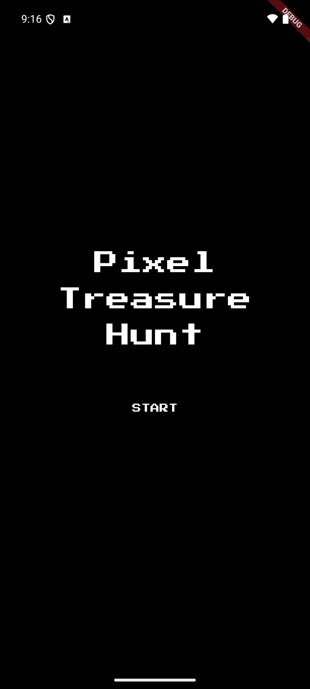
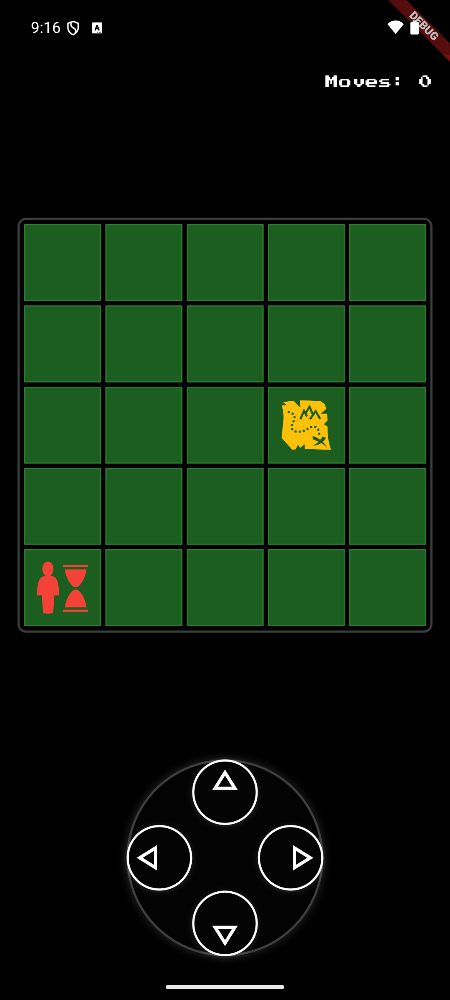
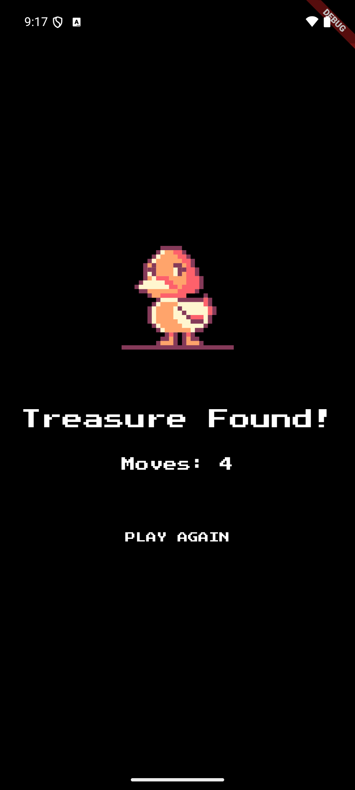

# Treasure Hunt Game

A fun and engaging treasure hunting game built with Flutter where players explore and search for hidden treasures.

## 🎮 Game Features

- Interactive treasure hunting gameplay
- Beautiful 2D graphics
- Score tracking system
- Multiple levels of difficulty
- Sound effects and background music

## 📱 Screenshots

<div style="display: flex; flex-wrap: wrap; gap: 10px;">
    
    
    
</div>

## 🎥 Gameplay Demo


## 🚀 Getting Started

1. Make sure you have Flutter installed on your machine
2. Clone this repository
```bash
git clone https://github.com/fitriadyaa/treasure-hunt.git
```
3. Install dependencies
```bash
flutter pub get
```
4. Run the app
```bash
flutter run
```

## 📱 Supported Platforms

- Android
- iOS

## 🛠️ Built With

- Flutter
- Dart

## 📄 License

This project is licensed under the MIT License - see the [LICENSE](LICENSE) file for details

## 🤝 Contributing

Contributions are welcome! Please feel free to submit a Pull Request.
